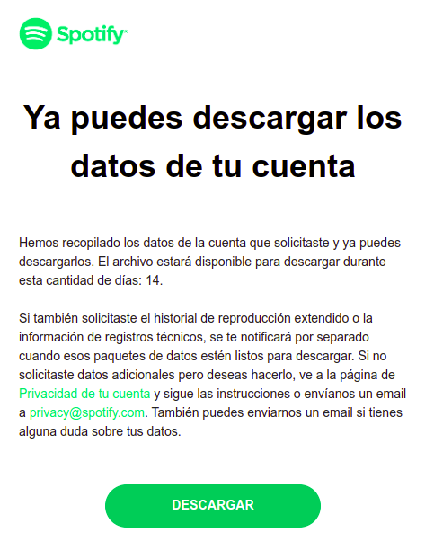

# Spotify WraPy

[English](README.md) / [Español](README.es.md)

Disfruta de tu experiencia en Spotify generando un video personalizado que muestra tus estadísticas de reproducción. Este video incluye varios gráficos informativos:

- Reproducciones por hora, mes y día de la semana: Visualiza tus hábitos de escucha a lo largo del día y tus patrones semanales y mensuales.
- Canciones principales y horas pico de escucha: Descubre tus pistas favoritas y los momentos en que las escuchas con mayor frecuencia.

Además, el video proporciona estadísticas detalladas, como:

- Tiempo total de reproducción: Mostrado en días, horas y minutos.
- Reproducciones totales: El número total de canciones que has escuchado.
- Canciones omitidas: Pistas que has saltado durante la reproducción.
- Artistas y canciones únicas: La diversidad de tus elecciones musicales.


## Descargar tus datos de Spotify
_Actualizado: 10 noviembre 2024_

- En la app de escritorio en el menú desplegable donde está tu foto de perfil selecciona la opción **Cuenta**.
- Elegir **Privacidad de la cuenta**.
- En la sección de **Descargar tus datos** seleccionada la opción de **Datos de cuenta**.
- Dar click en **Solicitar datos**.
- En 5-10 días te envíarán los datos a tu correo (el asociado a tu cuenta de Spotify) algo como esto:

 

- Da click en el botón de "Descargar". Se descargará una archivo `.zip`.
- Descomprime el archivo y tendrás una carpeta **my_spotify_data** con tus datos.

---------------

## Instalar el proyecto

**Requerimientos a instalar**

- Git
- Python 3.8 o una versión mayor.

**Descargar el repositorio**
```bash
git clone https://github.com/dbetm/spotify-wrapy.git
```

**Moverse al repo**

```bash
cd spotify-wrapy
```


**Instalar bibliotecas necesarias de Python**

```bash
make install
```

Nota: El comando anterior va a crear un entorno virtual de Python.

------------------------

## Generar video de Spotify WraPy

1) Dentro de la carpeta con tus datos busca los archivos llamados algo como `StreamingHistory.json`. Podría ser solo uno, llamado: `StreamingHistory0.json`.
2) Copia ese o esos archivos y pegalos en la carpeta `spotify_data/` que está dentro del repositorio.
3) Activa el entorno virtual, si no lo has hecho.
```bash
source .venv/bin/activate
```
4) En la línea de comandos ejecuta:
```bash
python3 app.py --lang spanish
```
También soporta idioma inglés: `python3 app.py --lang english` si no se pasa este argumento, por defecto estará en inglés.

Alternativamente puedes pasar la fecha de inicio y final para delimitar los datos a usar, ejemplo:
```bash
python3 app.py --lang spanish --start-date 2022-01-13 --end-date 2023-01-01
```
Y si no deseas generar el video:
```bash
python3 app.py --lang spanish --no-video
```
5) Los resultados se guardarán dentro de una carpeta (con nombre según la fecha y hora de ejecución) que estará dentro de la carpeta [output](output/).


**Nota importante**: El timestamp dado por Spotify usa tiempo UTC. En este proyecto por defecto se calcula la zona horaria de la computadora donde se ejecuta; puedes usar otra zona horaria ejecutando:

```bash
python3 app.py --tz America/New_York
```

La lista de timezones la puedes encontrar en [Wikipedia](https://en.wikipedia.org/wiki/List_of_tz_database_time_zones).

------------------


## Contribuye

Este es un proyecto sin fines de lucro, hecho solo por diversión :) no está asociado a Spotify de alguna forma oficial.

Tiene algunas mejoras, incluyendo el generar más gráficas o con otros estilos personalizables. Siéntete libre de contribuir:
- Haz un fork del repositorio.
- Deriva una rama nueva desde la rama `main`.
- Sube tu rama y abre un Pull Request apuntando a este repositorio.
