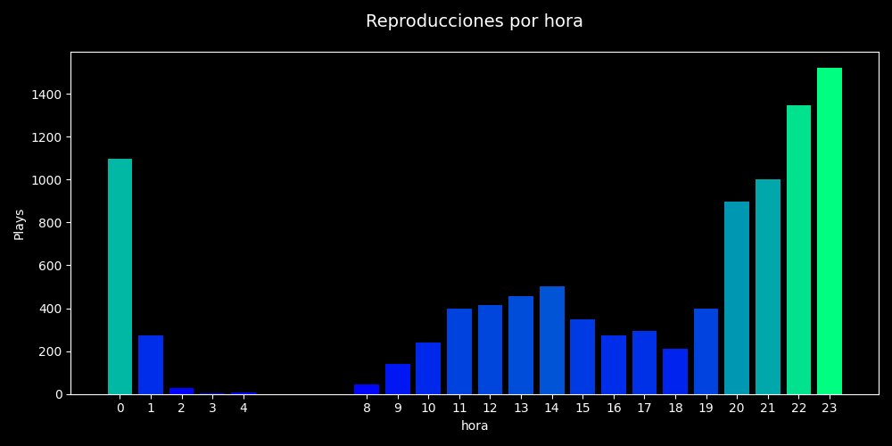
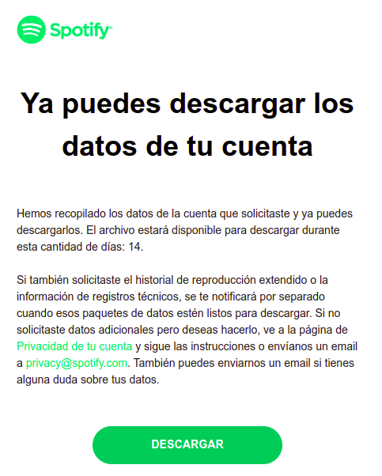

# Spotify Wrapy
Genera tres gráficas para visualizar las reproducciones por día de la semana, hora y mes. Además, algunos conteos simples como el tiempo total de reproducción en días, horas y minutos, total de reproducciones, canciones saltadas, número de artistas y canciones diferentes escuchadas.




## Descargar tus datos de Spotify
_Actualizado: 30 diciembre 2022_

- En la app de escritorio en el menú desplegable donde está tu foto de perfil selecciona la opción **Cuenta** o **Account**.
- En el menú de la izquierda selecciona **Configuración de privacidad** o **Privacy settings**.
- En la sección de **Descargar tus datos** o **Download your data** seleccionada la opción de **Datos de cuenta** o **Account data**.
- Dar click en **Solicitar datos** o **Request Data**.
- En 5-10 días te envíarán los datos a tu correo (el asociado a tu cuenta de Spotify) algo como esto:

 

- Da click en el botón de "Descargar". Se descargará una archivo `.zip`.
- Descomprime el archivo y tendrás una carpeta **my_spotify_data** con tus datos.

---------------

## Instalar el proyecto

**Requerimientos a instalar**

- [virtualenv](https://virtualenv.pypa.io/en/latest/)

**Descargar el repositorio**
```bash
git clone https://github.com/dbetm/spotify-wrapy.git
```

**Moverse al repo**

```bash
cd spotify-wrapy
```

**Crear entorno virtual**

```bash
virtualenv .venv --python=python3.8
```

**Activar el entorno virtual**

```bash
source .venv/bin/activate
```

Nota: En Windows podría ser un poco diferente ejecutar este comando.

**Instalar bibliotecas de Python**

```bash
make install
```

Nota: Si el comando anterior da error, puedes ejecutar:
- `source .venv/bin/activate`
- `pip install -r requirements.txt`

------------------------

## Generar mis gráficas y stats

1) Dentro de la carpeta con tus datos busca un archivo llamado algo como `StreamingHistory0.json`.
2) Copia ese archivo y pegalo en la carpeta `spotify_data/` que está dentro del repositorio.
3) Activa el entorno virtual, si no se ha hecho.
```bash
source .venv/bin/activate
```
4) En la línea de comandos ejecuta:
```bash
python3 app.py
```
5) Los resultados se guardarán dentro de una carpeta (con nombre según la fecha y hora de ejecución) que estará dentro de la carpeta [output](output/).


**Nota importante**: El timestamp dado por Spotify usa tiempo UTC. En este proyecto por defecto se convierte a la zona horaria de CDMX, México; puedes usar otra zona horaria ejecutando, por ejemplo, de la sig. manera:

```bash
python3 app.py --tz America/New_York
```

La lista de timezones la puedes encontrar en [Wikipedia](https://en.wikipedia.org/wiki/List_of_tz_database_time_zones).

------------------


## Contribuye

Este es un proyecto sin fines de lucro, hecho solo por diversión :)

Tiene algunas mejoras, incluyendo el generar más gráficas o con otros estilos personalizables. Siéntete libre de contribuir:
- Haz un fork del repositorio.
- Deriva una rama nueva desde la rama `main`.
- Sube tu rama y abre un Pull Request apuntando a este repositorio.