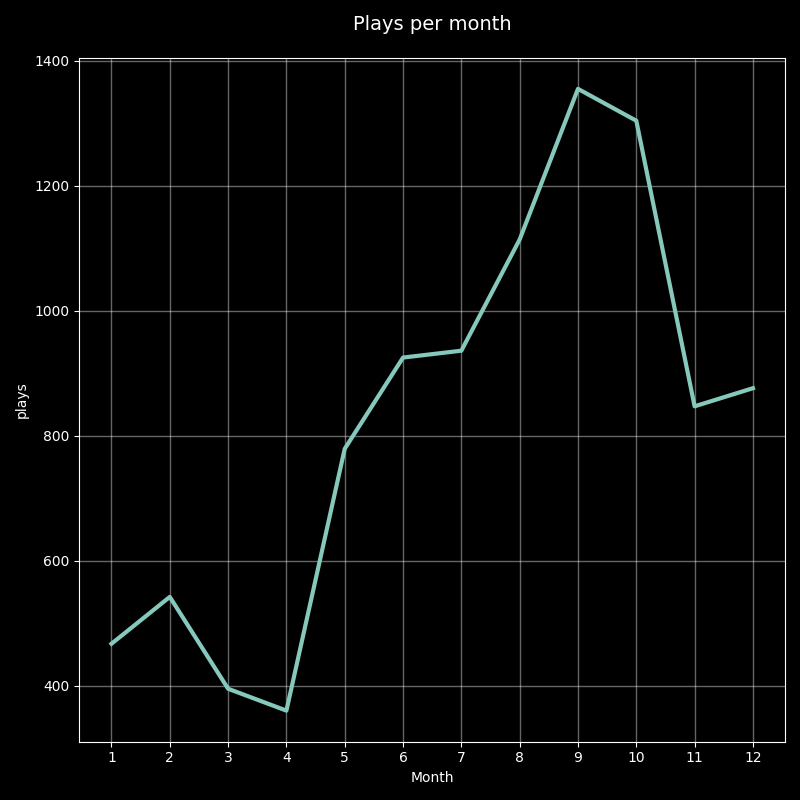

# Spotify WraPy

[English](README.md) / [Español](README.es.md)

Create three charts to visualize playbacks by day of the week, hour, and month, one card as image with the top songs listented to. Plus, get some simple counts like total play time in days, hours, and minutes, total playbacks, skipped songs, and the number of different artists and songs you've listened to. Optionally you can generate a video.




## Download your data from Spotify
_Updated: December 30th 2022_

- In the desktop app, go to the dropdown menu where your profile picture is and select the **Account** option.
- In the left-hand menu, choose **Privacy settings**.
- In the **Download your data** section, pick the **Account data** option.
- Click on **Request data**.
- In 5-10 days, they'll send the data to your email (the one linked to your Spotify account).
- Click the "Download" button. A `.zip` file will be downloaded.
- Unzip the file and you'll get a folder called **my_spotify_data** with your data inside.

---------------

## Setup project

**Requirements**

- [virtualenv](https://virtualenv.pypa.io/en/latest/)

**Download the repository**
```bash
git clone https://github.com/dbetm/spotify-wrapy.git
```

**Move to the repo folder**

```bash
cd spotify-wrapy
```

**Create virtual environment**

```bash
virtualenv .venv --python=python3.8
```

**Activate virtual environment**

```bash
source .venv/bin/activate
```

Note: On Windows, running this command might be a bit different.

**Install required Python libraries**

```bash
make install
```

Note: If the previous command gives an error, you can try running:
- `source .venv/bin/activate`
- `pip install -r requirements.txt`

------------------------

## Create my charts and stats

1) In the folder with your data, look for the files named something like `StreamingHistory.json`. It could be only one, example: `StreamingHistory0.json`.
2) Copy those files and paste them into the `spotify_data/` folder inside the repository.
3) Activate the virtual environment, if you haven't done so already.
```bash
source .venv/bin/activate
```
4) In the command line, run:
```bash
python3 app.py
```
It also supports Spanish language: `python3 app.py --lang spanish`. If this argument is not passed, it will default to English.

Alternatively, you can pass a start and end date to limit the data used, for example:
```bash
python3 app.py --lang english --start-date 2022-01-13 --end-date 2023-01-01
```
And you can generate a video, passing the `video` flag:
```bash
python3 app.py --lang english --video
```
5) The results will be saved in a folder (named according to the datetime of execution) inside the [output](output/) folder.


**Important note**: The timestamp provided by Spotify uses UTC time. By default, this project calculates the timezone of the computer it's run on; you can use a different timezone by running:

```bash
python3 app.py --tz America/New_York
```

You can find the list of timezones at [Wikipedia](https://en.wikipedia.org/wiki/List_of_tz_database_time_zones).

------------------


## Contribute

This is a non-profit project, made just for fun :) It is not associated with Spotify in any official way.

There are some possible improvements, including generating more charts or with customizable styles. Feel free to contribute:
- Fork the repository.
- Create a new branch from the `main` branch.
- Push your branch and open a Pull Request targeting this repository.
